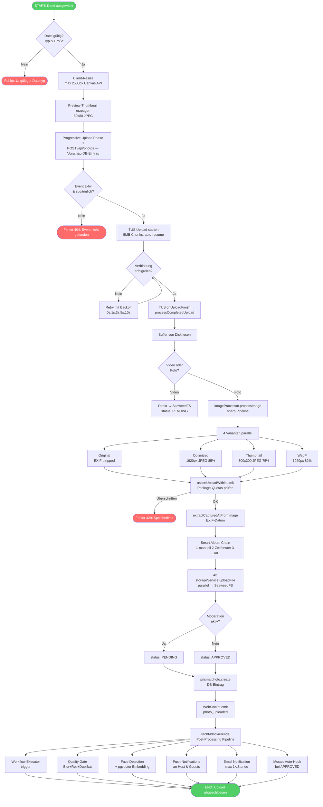
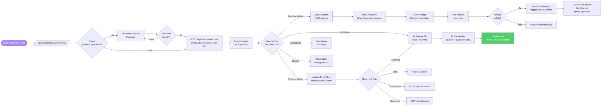
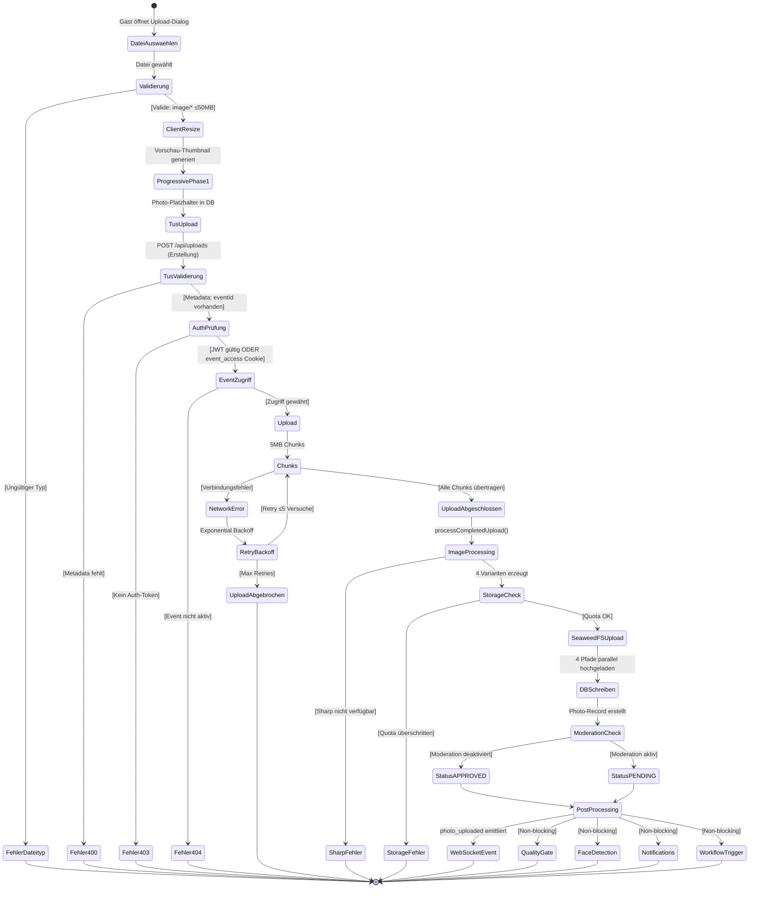
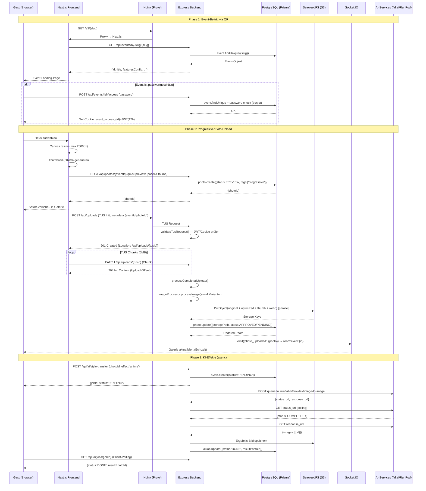
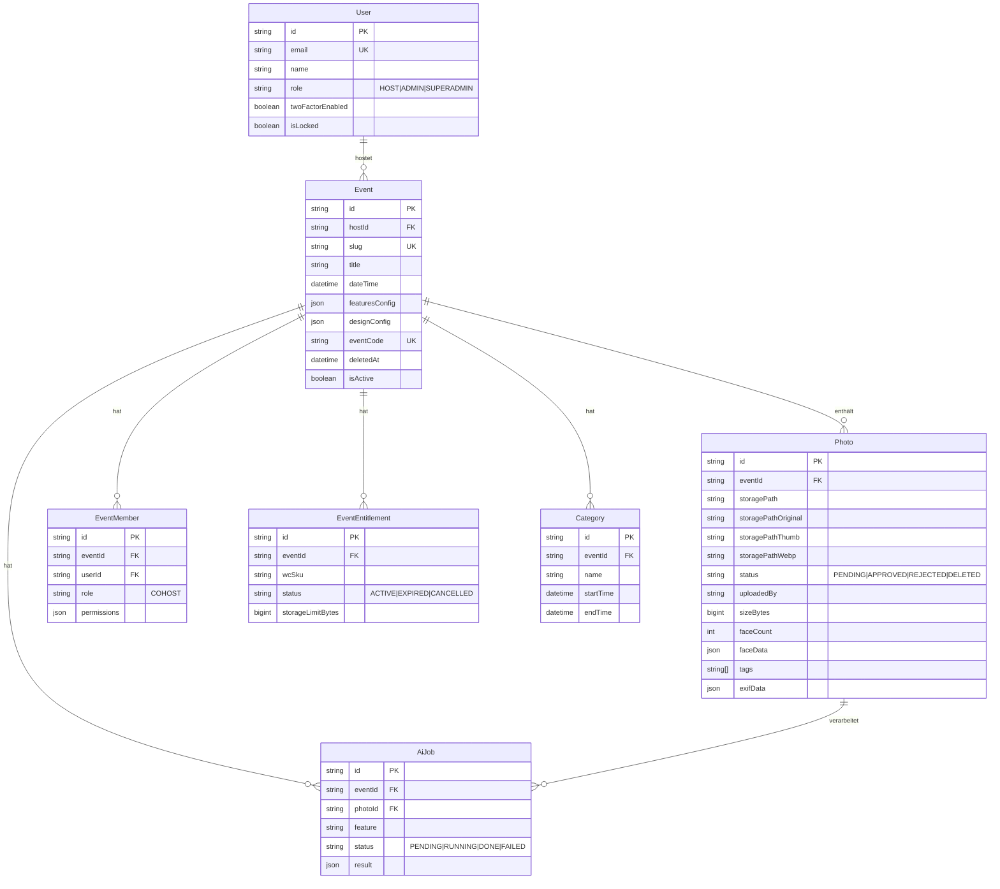

# GÄSTEFOTOS V2 — Technische Dokumentation
**Audit-Datum:** 2026-03-04 | **Version:** 2.1.0 | **Analyst:** Experten-Panel (Architektur, Dev, QA, Design, UX)

> ⚠️ **Gegenprüfung der bestehenden Docs:** Die README ist korrekt — sie referenziert durchgehend PostgreSQL, Redis und SeaweedFS. Die initiale Audit-Anfrage enthielt Begriffe wie "Supabase RLS", die nicht dem tatsächlichen Stack entsprechen. Das System verwendet **PostgreSQL + Prisma + eigene JWT-Middleware**, kein Supabase, keine Supabase RLS.

---

## Inhaltsverzeichnis
1. [Systemarchitektur](#1-systemarchitektur)
2. [Diagramm-Suite (Mermaid)](#2-diagramm-suite-mermaid)
3. [Algorithmus-Dokumentation](#3-algorithmus-dokumentation)
4. [Technologie-Stack](#4-technologie-stack)
5. [Datenmodell](#5-datenmodell)
6. [SDLC-Einordnung](#6-sdlc-einordnung)
7. [Deployment-Workflow](#7-deployment-workflow)
8. [Design- & UX-Audit](#8-design--ux-audit)

---

## 1. Systemarchitektur

Das Projekt ist ein **pnpm-Monorepo** mit 4 Packages, das als Self-Hosted SaaS-Platform auf einem dedizierten Linux-Server läuft.

```
                      ┌─────────────────────────┐
                      │      Cloudflare CDN/WAF  │
                      │  (DDoS, Bot-Schutz, SSL) │
                      └───────────┬─────────────┘
                                  │
                      ┌───────────┴─────────────┐
                      │    Nginx (Reverse Proxy) │
                      │  SSL-Termination, Gzip   │
                      └──┬──────┬───────────┬───┘
                         │      │           │
              ┌──────────┘      │           └──────────────┐
              │                 │                          │
  ┌───────────┴──────┐ ┌────────┴────────┐ ┌──────────────┴──────┐
  │  Frontend        │ │ Admin-Dashboard  │ │  Backend (API)      │
  │  Next.js 16      │ │ Next.js 16       │ │  Express.js         │
  │  Port 3000       │ │ Port 3001        │ │  Port 8001          │
  │  app.gästefotos  │ │ dash.gästefotos  │ │  Socket.IO (WS)     │
  └────────┬─────────┘ └────────┬─────────┘ └──────────┬──────────┘
           └────────────────────┴─────────────────────┘
                                │
        ┌──────────┬────────────┼────────────┬──────────────┐
        │          │            │            │              │
  ┌─────┴────┐ ┌───┴────┐ ┌────┴─────┐ ┌────┴─────┐ ┌─────┴────┐
  │PostgreSQL│ │ Redis  │ │SeaweedFS │ │ RunPod   │ │External  │
  │95 Models │ │Cache + │ │S3-Store  │ │ComfyUI   │ │AI APIs   │
  │Prisma ORM│ │Sessions│ │Photos/   │ │Qwen/Flux │ │fal.ai    │
  │54 Migrat.│ │CSRF/RL │ │Videos    │ │GPU Worker│ │Groq/xAI  │
  └──────────┘ └────────┘ └──────────┘ └──────────┘ └──────────┘

Produktionspfad: /opt/gaestefotos/app/ (User: gaestefotos, systemd)
Entwicklungspfad: /root/gaestefotos-app-v2/
```

### Package-Übersicht

| Package | Framework | Port | Beschreibung |
|---|---|---|---|
| `backend` | Express.js 4, Prisma 5, Socket.IO 4 | 8001 | API-Server — **117 Route-Dateien, 95 DB-Modelle** |
| `frontend` | Next.js 16, React 18, Tailwind CSS 3 | 3000 | Guest & Host App — **68 Seiten, 269 Komponenten** |
| `admin-dashboard` | Next.js 16, React 18, Tailwind CSS 3 | 3001 | Admin-UI — **57 Seiten** |
| `shared` | TypeScript | — | Gemeinsame Types & Utils |

---

## 2. Diagramm-Suite (Mermaid)

### 2.1 Programmablaufplan (PAP) — Foto-Upload-Kern-Algorithmus



---

### 2.2 Flussdiagramm — User-Journey: QR-Scan bis Foto-Upload



---

### 2.3 UML Aktivitätsdiagramm — Upload-Flow mit Exception Handling (Docusnap-Stil)



---

### 2.4 Sequenzdiagramm — Client ↔ Backend ↔ Storage (zeitliche Interaktion)



---

### 2.5 Prozess-/Ablaufdiagramm — Event-Lifecycle (Event-Erstellung bis Archivierung)

```mermaid
timeline
    title Event-Lifecycle bei Gästefotos.com
    section Planung
        Host registriert sich : Account erstellen (email/password + optional WP SSO)
        Paket wählen : WooCommerce Checkout (Free/Basic/Smart/Premium)
        Event anlegen : /create-event (Titel, Datum, Ort, Thema)
    section Setup
        QR-Code designen : QR-Designer (SVG-Templates, Logo, Farbe)
        Galerie konfigurieren : Moderation, Upload-Fenster, Gästeliste
        Einladungen gestalten : Digitale Einladungskarte (i/{slug})
        Workflow einrichten : Automation-Builder (AI-Kategorisierung etc.)
    section Event-Tag
        Gäste scannen QR : → Galerie (e3/{slug}) oder Live-Wall
        Fotos werden hochgeladen : TUS Upload (resumable, offline-fähig)
        Live-Wall läuft : Socket.IO Echtzeit (photo_uploaded Events)
        Booth-App aktiv : KI-Booth / Drawbot / Fotobox
    section Nachbearbeitung
        Host moderiert : Fotos genehmigen/ablehnen
        KI-Effekte anwenden : Style Transfer, Face Swap, BG Removal
        Mosaic Wall generieren : CIE Lab Delta-E Farbabgleich
        Gästebuch exportieren : PDF-Export
        Download-ZIP bereitstellen : Bulk-Download für Gäste
    section Archivierung
        Storage-Erinnerung : Email 14d vor Ablauf (StorageReminder)
        Purge-Datum erreicht : retentionPurge.ts löscht Dateien
        Event archiviert : deletedAt gesetzt (Soft-Delete)
        DB bereinigt : eventPurgeWorker.ts (cron)
```



---

## 3. Algorithmus-Dokumentation

### 3.1 QR-Code-zu-Event-Mapping (Formale Beschreibung)

**Input:** URL-Pfad `/e3/{slug}` oder `/live/{slug}` aus QR-Code

**Algorithmus:**
```
1. Slug-Extraktion: slug ← URL.pathname.split('/')[2]
2. DB-Lookup: event ← DB.events.findUnique(WHERE slug = slug AND deletedAt IS NULL)
3. Existenzprüfung: IF event IS NULL THEN → 404
4. Aktivitätsprüfung: IF event.isActive = FALSE THEN → 404
5. Passwortprüfung:
   IF event.password IS NOT NULL THEN
     cookie ← req.cookies['event_access_' + event.id]
     IF cookie IS NULL OR jwt.verify(cookie).eventId ≠ event.id THEN
       → Passwort-Formular anzeigen
     ELSE
       → Galerie anzeigen (Cookie gültig)
   ELSE
     → Galerie anzeigen (kein Passwort)
6. Traffic-Tracking: EventTrafficStat.upsert(eventId, source) [nicht-blockierend]
7. Response: Event-Daten + featuresConfig + Entitlement (Paket-Tier)
```

**QR-Code-Generierung:**
- Basis-URL: `https://app.xn--gstefotos-v2a.com/e3/{slug}`
- Alternativer eventCode: Kürzerer Code für Marketingmaterial
- Exportformate: PNG (300dpi), PDF (A4/Postkarte), SVG
- Bibliothek: `qr-code-styling` (Frontend) + `qrcode` (Backend PDF-Export)

### 3.2 Smart-Album-Zuweisung (3-stufige Kette)

```
Eingabe: eventId, capturedAt (EXIF-Datum oder Upload-Zeit)

Stufe 1 — Manuelle Zuweisung:
  IF metadata.categoryId IS SET → return categoryId

Stufe 2 — Zeitfenster (selectSmartCategoryId):
  categories ← DB.categories WHERE eventId = eventId ORDER BY startTime
  FOR EACH category WITH startTime/endTime:
    IF capturedAt IN [startTime, endTime] → return category.id
  → null

Stufe 3 — EXIF-Fallback (resolveSmartCategoryId):
  categories ← DB.categories WHERE eventId ORDER BY dateTime DESC
  FOR EACH category WITH dateTime:
    delta ← |capturedAt - category.dateTime|
    IF delta < 2h → return category.id (nächstgelegene Kategorie)
  → null (Kein Album → Standard-Galerie)
```

### 3.3 Blur-Erkennung (Laplacian-Varianz-Approximation)

```
Eingabe: Buffer (Bilddaten)

1. Resize auf 512px (Konsistenz + Performance)
2. Greyscale-Konvertierung
3. Pixel-Array extrahieren (raw)
4. Laplacian-Kernel-Approximation (3x3):
   kernel = [0, -1, 0, -1, 4, -1, 0, -1, 0]
5. Kantenintensitäts-Summe berechnen
6. Varianz = Summe / Pixel-Anzahl
7. Bewertung:
   - score < 50  → isBlurry = true  (REJECT)
   - score < 100 → isWarning = true (WARN)
   - score ≥ 100 → scharf     (PASS)
```

### 3.4 Duplikat-Erkennung (Perceptual Hash + SHA-256)

```
Eingabe: Buffer

1. SHA-256-Hash berechnen (exaktes Duplikat)
   IF SHA-256 in DB → isDuplicate = true, return (sofort)

2. Perceptual Hash (aHash, 8x8):
   a. Resize auf 8x8 Greyscale
   b. Durchschnitt aller Pixel berechnen
   c. Hash = Binär-String: pixel[i] > avg ? '1' : '0'

3. Hamming-Distanz zu bestehenden Hashes:
   distance = Σ (bit_a XOR bit_b)
   IF distance ≤ 5 → ähnlich (SIMILARITY_THRESHOLD)

4. Duplikat-Gruppe: Alle ähnlichen Fotos werden gruppiert
   bestInGroup = Bild mit höchster Schärfe (höchster Blur-Score)
```

### 3.5 Mosaic-Engine (CIE Lab Delta-E Farbabgleich)

```
Eingabe: Zielbild (Grid), Pool aller Fotos im Event

1. Zielbild in N×M Kacheln aufteilen
2. Pro Kachel: Durchschnittsfarbe → RGB → CIE XYZ → CIE Lab
3. Pool-Fotos: Durchschnittsfarbe vorberechnen und cachen
4. Für jede Kachel: Delta-E 2000 zu allen Pool-Fotos berechnen
   deltaE = perceptueller Farbabstand (CIE2000-Formel)
5. Bestes Match: min(deltaE) → Kandidat
6. Anti-Repetition: Bereits häufig verwendete Fotos werden penalisiert
7. Ausgabe: Grid-Map {kachel → photoId} → Sharp Composite
```

---

## 4. Technologie-Stack

### 4.1 Backend

| Technologie | Version | Rolle |
|---|---|---|
| Node.js | ≥18.0.0 | Laufzeitumgebung |
| Express.js | ^4.18.2 | HTTP-Framework, 117 Route-Dateien |
| Prisma | ^5.7.0 | ORM, 95 Modelle, 54 Migrationen |
| PostgreSQL | — | Hauptdatenbank (pgvector für Face-Embeddings) |
| Socket.IO | ^4.6.0 | WebSocket Echtzeit-Kommunikation |
| Redis (ioredis) | ^5.7.0 | Cache, Sessions, CSRF-Tokens, Rate-Limiting |
| SeaweedFS | — | S3-kompatibler Objektspeicher (Fotos/Videos) |
| AWS SDK S3 | ^3.490.0 | Client-Bibliothek für SeaweedFS |
| @tus/server | ^2.3.0 | Resumable Upload-Server |
| Sharp | ^0.34.5 | High-Performance Bildverarbeitung |
| BullMQ | ^5.69.3 | Job-Queue für AI-Tasks |
| Zod | ^3.22.4 | Schema-Validierung |
| JWT (jsonwebtoken) | ^9.0.2 | Auth-Token, Event-Access-Cookie |
| bcryptjs | ^2.4.3 | Passwort-Hashing |
| Helmet | ^7.2.0 | Security-Header |
| express-rate-limit | ^7.5.0 | Rate-Limiting (Redis-backed) |
| Winston | ^3.17.0 | Structured Logging |
| Nodemailer | ^7.0.13 | Email (DB-konfiguriertes SMTP) |
| web-push | ^3.6.7 | Web Push Notifications |
| fluent-ffmpeg | ^2.1.3 | Video-Processing |
| pdf-lib + pdfkit | — | PDF-Generierung (QR, Gästebuch) |
| TensorFlow.js | ^4.22.0 | Face-API (lokale Face-Detection) |
| @vladmandic/face-api | ^1.7.15 | Face-Erkennung-Modelle |
| Sentry | ^10.0.0 | Error-Tracking |

### 4.2 Frontend

| Technologie | Version | Rolle |
|---|---|---|
| Next.js | ^16.1.2 | React-Framework (App Router) |
| React | ^18.2.0 | UI-Bibliothek |
| Tailwind CSS | ^3.3.6 | Utility-first CSS |
| Radix UI | diverse | Accessible UI-Primitives |
| Framer Motion | ^10.16.0 | Animationen |
| TanStack Query | ^5.12.2 | Server-State Management |
| Zustand | ^4.4.7 | Client-State Management |
| tus-js-client | ^4.3.1 | Resumable Uploads |
| Socket.IO Client | ^4.6.0 | WebSocket-Client |
| next-intl | ^3.26.2 | i18n (de/en/fr/es/it) |
| Axios | ^1.6.2 | HTTP-Client |
| react-dropzone | ^14.2.3 | Drag-&-Drop Upload |
| Lucide React | ^0.294.0 | Icons |
| Recharts | ^3.5.1 | Diagramme (Statistiken) |
| Konva / react-konva | ^10.2.0 | Canvas (QR-Designer) |
| Leaflet | ^1.9.4 | Karten (Event-Ort) |
| Sentry | ^10.32.1 | Frontend Error-Tracking |

### 4.3 AI-Provider-Stack

| Provider | Verwendung | Modell |
|---|---|---|
| fal.ai | Style Transfer, Face Swap, Video | flux/dev/image-to-image, face-swap, wan-i2v |
| Groq | LLM-Features (primär) | llama-3.3-70b-versatile |
| xAI (Grok) | LLM-Features | grok-2-vision |
| OpenAI | LLM-Fallback | gpt-4o |
| Ollama (lokal) | Offline-Fallback | llama3.2:3b, llava:7b |
| RunPod (Qwen) | ComfyUI Workflows | Qwen Image Edit fp8 |
| remove.bg | Background Removal | — |
| Replicate | Fallback Style Transfer | — |

### 4.4 Infrastruktur

| Komponente | Details |
|---|---|
| OS | Linux (Ubuntu) |
| Webserver | Nginx (SSL-Terminierung, Reverse Proxy, Gzip) |
| CDN/WAF | Cloudflare |
| Deployment | systemd (gaestefotos-backend, -frontend, -admin-dashboard, -print-terminal) |
| Produktionspfad | `/opt/gaestefotos/app/` |
| Entwicklungspfad | `/root/gaestefotos-app-v2/` |
| Paketmanager | pnpm ≥8.0.0 |
| E2E-Tests | Playwright ^1.49.0 |

---

## 5. Datenmodell

### 5.1 Kern-Entitäten (vereinfacht)



### 5.2 URL-Struktur

| URL-Pattern | Zweck |
|---|---|
| `/e3/{slug}` | Öffentliche Event-Galerie (Haupt-Gast-URL) |
| `/live/{slug}` | Live-Wall (Echtzeit-Projektion) |
| `/i/{slug}` | Digitale Einladung |
| `/s/{slug}` | Slideshow-Modus |
| `/r/{id}` | Redirect (Kurz-Link) |
| `/events/{id}/dashboard` | Host-Dashboard |
| `/events/{id}/photos` | Foto-Verwaltung |
| `/events/{id}/qr-styler` | QR-Code Designer |
| `/dashboard` | Host-Übersicht (alle Events) |

---

## 6. SDLC-Einordnung

### 6.1 Aktuelle Phase: **Production / Maintenance + Feature-Expansion**

Das Projekt befindet sich **gleichzeitig in Deployment-Betrieb und aktiver Feature-Entwicklung**, was einer hybriden Phase zwischen **Deployment und Maintenance** entspricht.

| SDLC-Phase | Status | Begründung |
|---|---|---|
| **Planning** | ✅ Abgeschlossen | Architektur definiert, Paket-Tiers designt, WooCommerce-Integration live |
| **Analysis** | ✅ Abgeschlossen | 95 DB-Modelle, 117 API-Routes zeigen umfassendes Requirements-Engineering |
| **Design** | ✅ Überwiegend | Systemdesign vorhanden; Design-System (Tailwind + Radix) etabliert |
| **Implementation** | 🔄 Laufend | KI-Features (Qwen/RunPod), i18n, Print-Terminal in Entwicklung |
| **Testing** | 🔄 Teilweise | 22 E2E-Tests (Playwright); Unit-Tests vorhanden aber lückenhaft |
| **Deployment** | ✅ Live | Produktion läuft auf `/opt/gaestefotos/app/` via systemd |
| **Maintenance** | 🔄 Laufend | Bug-Fixes, Performance-Optimierungen, AI-Provider-Fixes |

### 6.2 Code-Qualitäts-Indikatoren

| Indikator | Bewertung | Detail |
|---|---|---|
| TypeScript | ⚠️ Teilweise strikt | `noEmit` ohne `strict:true` in tsconfig; `any`-Typen verbreitet |
| Test-Coverage | ⚠️ Mittel | 22 E2E-Tests, 206 Unit-Tests (25 Test-Dateien); kritische Services getestet (runpodService, csrf, duplicateDetection, imageProcessor) |
| Error-Handling | ✅ Gut | Alle async Routes haben try/catch; Non-blocking Post-Processing korrekt |
| Logging | ✅ Gut | Winston Structured Logging; Audit-Log für kritische Aktionen |
| Security | ✅ Gut | CSP ohne unsafe-eval; ClamAV-Fehler → quarantine; CSRF auf allen /api Routes; IP-basiertes Upload-Limit; GPS-EXIF-Strip (Bild + Metadaten-JSON); Admin 2FA enforced |
| API-Konsistenz | ✅ Gut | Upload-Limits harmonisiert (Multer + TUS = 100MB); Error-Formate überwiegend konsistent |
| Dokumentation | ⚠️ Mittel | README-Zahlen aktuell (117 Routes, 95 Models, 68 Pages); Supabase nur in Archiv-Docs; JSDoc spärlich |
| Internationalisierung | ✅ Aktiv | 5 Sprachen (de/en/fr/es/it) via cookie-basiertem Ansatz (NEXT_LOCALE), AutoLocaleDetect + LanguageSelector |

---

## 7. Deployment-Workflow

### 7.1 Lokale Entwicklung → Produktion

```mermaid
flowchart LR
    A[/root/gaestefotos-app-v2/\nEntwicklung] -->|1. Code-Änderung| B[git add + commit]
    B -->|2. Tests| C[pnpm e2e / vitest]
    C --> D{Tests OK?}
    D -- Nein --> A
    D -- Ja --> E[rsync/cp nach\n/opt/gaestefotos/app/]
    E -->|3. Build| F[pnpm build\n/opt/gaestefotos/app/]
    F -->|4. Restart| G[systemctl restart\ngaestefotos-backend]
    G --> H[systemctl restart\ngaestefotos-frontend]
    H --> I[systemctl restart\ngaestefotos-admin-dashboard]
    I -->|5. Verify| J[check_services.sh]
    J --> K([Produktion Live\napp.gästefotos.com])
```

### 7.2 Systemd Services

| Service | Beschreibung |
|---|---|
| `gaestefotos-backend` | Express API Server (Port 8001) |
| `gaestefotos-frontend` | Next.js Frontend (Port 3000) |
| `gaestefotos-admin-dashboard` | Admin Next.js (Port 3001) |
| `gaestefotos-print-terminal` | Druck-Terminal App |

### 7.3 ComfyUI / RunPod Docker Deployment

```
1. Modelle in Dockerfile einbinden (HuggingFace Downloads)
2. docker build → brandboost/gaestefotos-comfyui-worker:v2-qwen-DATUM
3. docker push → Docker Hub
4. RunPod Endpoint fkyvpdld673jrf auf neues Image aktualisieren
5. Workflow-JSONs via /api/workflow-sync synchronisieren
```

---

## 8. Design- & UX-Audit

### 8.1 Visual Check — UI-Konsistenz

**Stärken:**
- Tailwind CSS mit konsistentem Design-System (gradient-basierte CTA-Buttons: pink → gelb)
- Framer Motion für Animationen (Upload-Konfetti, Lightbox-Übergänge)
- Radix UI für accessible Primitives (Dialog, Dropdown, Toast)
- Dark-Mode-Support via `next-themes`
- Responsive Design durch Tailwind-Breakpoints

**Schwächen:**
- Inkonsistente Icon-Bibliothek: Mix aus Lucide React und inline SVGs gefunden
- Keine Storybook-/Chromatic-Dokumentation der Komponenten
- `ModernPhotoGrid.tsx` mit 42.292 Bytes ist zu groß (Single-Responsibility verletzt)
- `UploadButton.tsx` mit 34.039 Bytes ist zu groß
- Keine Design-Tokens-Datei — Farben direkt in `tailwind.config.ts`, nicht zentralisiert als CSS-Variablen

### 8.2 UX-Conversion — Guest-Workflow-Bewertung

**Kritischer Pfad:** QR-Scan → Galerie anzeigen → Upload

| Schritt | UX-Bewertung | Problem |
|---|---|---|
| QR-Scan → Landing | ✅ Gut | Sofortiger Seiten-Load, kein Login nötig |
| Passwort-Eingabe | ⚠️ Mittel | Kein "Passwort zeigen"-Toggle dokumentiert |
| Upload-Button finden | ⚠️ Mittel | FAB (Floating Action Button) kann übersehen werden |
| Upload-Feedback | ✅ Gut | Progressiv mit Echtzeit-Preview + Konfetti |
| Fehler-Recovery | ✅ Gut | TUS auto-resume, exponential backoff |
| Upload-Limit-Info | ✅ Gut | `GET /api/uploads/limit/:eventId` + UploadButton zeigt verbleibende Uploads |
| Offline-Support | ✅ Gut | `OfflineQueueIndicator.tsx` + `uploadQueue.ts` vorhanden |

**Conversion-Hürden:**
1. Kein expliziter "Jetzt Foto hochladen" CTA auf der Event-Landing-Page Above-the-Fold
2. ~~Fehlende Fortschrittsanzeige für maxUploadsPerGuest-Limit~~ — **GEFIXT (2026-03-06)**
3. KI-Effekte sind nicht direkt auf Galerie-Fotos sichtbar, erfordern Navigation

### 8.3 Branding-Potenzial

**Aktuelle Positionierung:** Event-Foto-Platform als SaaS + Hardware ("Made in Austria")

**Empfehlungen:**
1. **White-Label**: `customThemeData` im Datenmodell vorhanden — Custom Branding für Partner besser exponieren
2. **Event-Sharing**: Social-Share-Komponente (`SocialShare.tsx`) ausbauen mit Open Graph Meta-Tags pro Event
3. **Testimonials/Social Proof**: Landing Page (`/page.tsx`, 30.545 Bytes) überarbeiten mit konkreten Kennzahlen
4. **QR-Code als Marken-Asset**: QR-Designer unterstützt Logo-Integration — aktiver im Onboarding vermarkten
